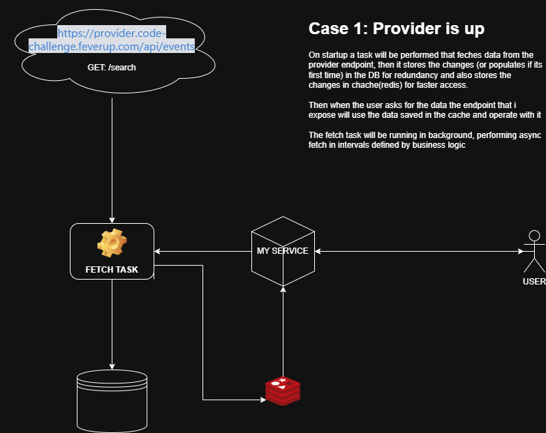
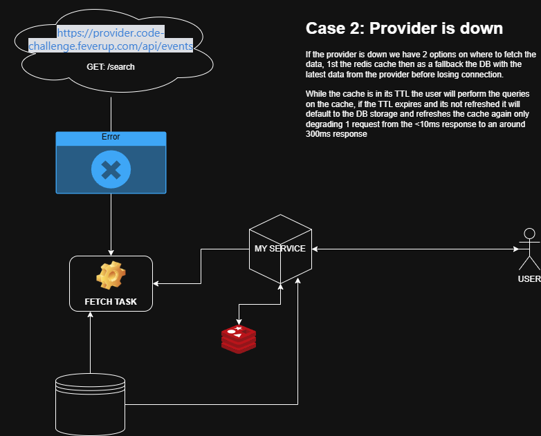

# Fever code challenge

Welcome! We're thrilled to have you at this stage of the process. This challenge is designed to give us insight into your coding approach and problem-solving skills. It’s a simplified example of real-world scenarios we handle daily at Fever.

## ------ RUBEN JUAREZ PEREZ ------
## System Design
### Case 1: Provider is up



In this scenario, the external provider is available
When the application starts:
1. An asynchronous task (Fetch Task) is launched to retrieve data from the provider, using retry logic to ensure communication even if temporary issues occur
2. The data is stored or updated in the database for persistence.
3. It is also saved in Redis for fast responses.
4. When the user requests data through the /api/v1/search endpoint, the cached data is returned.

This synchronization task keeps running in the background at defined intervals, ensuring the data is always up to date

---

### Case 2: Provider is down



If the external provider is unavailable:
1. The Fetch Task detects the error (for example, a 503 Service Unavailable)
2. The system uses the most recent data stored in the database to refill the cache
3. Users continue receiving data without interruptions, ensuring zero downtime
4. 
In this way, even if the provider is down, the service continues responding correctly

---

## How to Run the Application

### Requirements
- Docker & Docker Compose
- Make
- Java 21+
- Maven 3.9+

---
### Setup & Run
Once the repository has been cloned, run the following commands from the project root:
```bash
# 1. Build the Java project
make build

# 2. (Re)build the Docker images and start all services
make run
```
## My extra mile

- **Scalability:** How would you handle a scenario where the provider sends thousands of plans with hundreds of zones per plan?
> If the provider payload grows significantly, batch inserts and pagination strategies could be applied to reduce memory usage and improve write performance
> We could even discuss an aws lambda implementation but only if the provider had a webhook system or a notification system, with that we could stop using the task
- **High Traffic:** How would your service respond to 5k-10k requests per second?
> Multiple stateless application instances can be deployed behind a load balancer
- **Optimization Strategies:** How can the system remain performant under heavy load?
  > Database connection pooling, async I/O for external requests, and efficient cache TTL refreshes
  > With that we could keep latency low and throughput stable, even when the system experiences heavy concurrent demand.

## About Fever

At Fever we work to bring experiences to people. We have a marketplace of plans from different providers that are curated and then consumed by multiple applications. We work hard to expand the range of experiences we offer to our customers. Consequently, we are continuously looking for new providers with great plans to integrate in our platforms.
## The challenge

Your task is to develop a microservice that integrates plans from an external provider into the Fever marketplace.

Even if this is just a disposable test, imagine that somebody will pick up this code and maintain it in the future. It will evolve new features will be added, existing ones adapted, and unnecessary functionalities removed. Writing clean, scalable, and maintainable code is crucial for ensuring the sustainability of any project.

> [!TIP]
> This should be conceived as a long-term project, not just one-off code.

The external provider exposes an endpoint: https://provider.code-challenge.feverup.com/api/events

This API returns a list of available plans in XML format. Plans that are no longer available will not be included in future responses. Here are three example responses over consecutive API calls:

- [Response 1](https://gist.githubusercontent.com/acalvotech/55223c0e5c55baa33086e2383badba64/raw/1cab82e2d1f3adc8d3b3dace0a409844bed698f0/response_1.xml)
- [Response 2](https://gist.githubusercontent.com/acalvotech/d9c6fc5a5920bf741638d6179c8c07ed/raw/2b4ca961f05b2eebc0682f21357d37ac0eb5c80a/response_2.xml)
- [Response 3](https://gist.githubusercontent.com/acalvotech/7c107daacfd05f32c1c1bcd7209d85ef/raw/ea4c4c8d2b7ccf2ae2be153d45353fb7187f5236/response_3.xml)

> [!WARNING]
> The API endpoint has been designed with real-world conditions in mind, where network requests don’t always behave ideally. Your solution should demonstrate how you handle various scenarios that could occur in production environments. **Don’t assume the API endpoint will always respond successfully and with low latency.**

## Your Task

You need to **develop and expose a single endpoint**:

- **API Spec:** [SwaggerHub Reference](https://app.swaggerhub.com/apis-docs/luis-pintado-feverup/backend-test/1.0.0)
- The endpoint should accept `starts_at` and `ends_at` parameters and return only the plans within this time range.
- Plans should be included if they were ever available (with `"sell_mode": "online"`).
- Past plans should be retrievable even if they are no longer present in the provider’s latest response.
- The endpoint must be performant, responding in **hundreds of milliseconds**, regardless of the state of other external services. For instance, if the external provider service is down, our search endpoint should still work as usual. Similarly, it should also respond quickly to all requests regardless of the traffic we receive.

## Evaluation criteria

Your solution will be evaluated holistically, with special attention to:

- **Problem-Solution Fit:** How well your solution aligns with the given problem.
- **Adherence to API Spec:** Follow the provided OpenAPI specification.
- **Documentation:** Provide a README explaining design choices and implementation details, additional design schemas will be valued.
- **Makefile:** Include a Makefile with a run target to simplify running the application.
- **Code Quality:** Readability, maintainability, and adherence to best practices.
- **Software Architecture:** Structural design choices and scalability considerations.
- **Efficiency:** Optimize for both resources and time efficiency.

## Guidelines

- We strongly encourage you to **implement the solution in the language you are most comfortable with**, even if it's not Python. We've seen candidates try to adapt to Python for the sake of the challenge, but that often results in lower code quality and doesn't reflect their real strengths.
- The application will be run on a clean machine with almost no dependencies, so make sure your app installs everything it needs to run in a simple way (one or two commands at most). We encourage to implement a docker compose file, but it is not a requirement.
- Feel free to use any libraries, frameworks, or tools that best fit the task.
- Submit your code in the `master` branch of this repository.

## Going the extra mile 🚀

To make your solution even stronger, consider:

- **Scalability:** How would you handle a scenario where the provider sends thousands of plans with hundreds of zones per plan?
- **High Traffic:** How would your service respond to 5k-10k requests per second?
- **Optimization Strategies:** How can the system remain performant under heavy load?

You can implement these enhancements in your code or describe your approach in the README.

## Need Help?

If you have any questions, feel free to reach out. We’ll get back to you as soon as possible.

## Feedback

We value your time and effort! Please take a moment to share your thoughts on our process:

[📋 Feedback Form](https://forms.gle/6NdDApby6p3hHsWp8)

Thank you for participating, and good luck! 🎉
